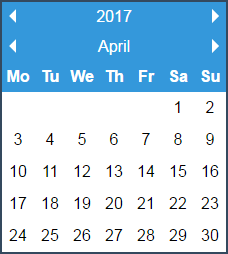

# Простой календарь

Первый репозиторий. Простой календарь/data-picker

## Использование:

### Инициализация:
    var calendar = new Calendar(year, month, id);
* year - год (например 2015)
* month - месяц (от 0 до 11)
* id - ид элемента который станет родителем календаря

### Публичные методы:
* ***.setDate(year, month)*** - устанавливает текущую дату календаря
    * year - год
    * month - месяц

### Отлов событий:
    document.getElementById(id).addEventListener("selectDate", function(e) {});
#### Типы событий:
* '**selectDate**' - возникает при выборе даты
  * Возвращает объет Date (nowDate) с выбранной датой.
* '**changeMonth**' - возникает при изменении месяца 
* '**changeYear**'  - возникает при изменении года
    * оба события возвращают объект Date (nowDate) с текущей датой, и объект Date (oldDate) с датой, которая была до возникновения этого события

### Методы возвращаемых объектов:
    document.getElementById("cal").addEventListener("selectDate", function(e) {
		console.log(e.detail.nowDate.getDayOfWeek()); //Monday
	});
**Кроме стандартных методов, которые есть во всех объектах Date, используются следующие методы:**
* ***.getFullDay()*** - возвращает чисто, равное количеству дней в данном месяце
* ***.getNewDay()*** - возвращает день недели в виде числа (от 0 - _понедельник_ до 6 - _воскресенье_) 
* ***.getNewMonth()*** - возвращает название месяца в виде строки вида - _"January"_
* ***.getDayOfWeek()*** - возвращает название дня недели в виде строки вида - "Monday"
* ***.getFormatDate()*** - возвращает дату в формате строки
    * вызов без аргументов возвращает строку вида - _"10-01-2015"_  
    * при вызове можно передать, в качестве аргумента, строку вида - ***"dd-mmm-yyyy"***, тогда метод вернет строку, выбранного формата:
        * **dd** - 01
        * **ddd** - Mon
        * **dddd** - Monday
        * **mm** - 01
        * **mmm** - Jan
        * **mmmm** - January
        * **yy** - 15
        * **yyyy** - 2015
 
Пример использования: 

	document.getElementById("cal").addEventListener("selectDate", function(e) {
		console.log(e.detail.nowDate.getFormatDate("ddd:mm:yy")); //Fri:01:15
	});
